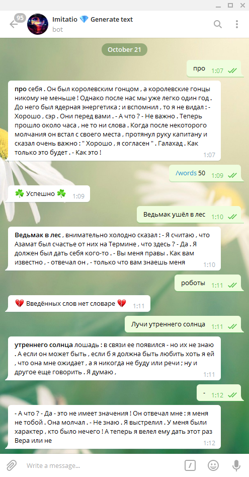

# Telegram bot with text-generating recurrent neural network.

### Bot name
@Imitatio_generate_sequence_bot

### Bot View



### Deploy
```shell
#[step 1]
docker build -t text_generation_bot:v1.0-no-proxy .

#[step 2]
docker run text_generation_bot:v1.0-no-proxy

#[step 3]
docker tag text_generation_bot:v1.0-no-proxy gcr.io/telegrambot-1-215117/text_generation_bot:v1.0-no-proxy

#[step 4]
#https://console.cloud.google.com/gcr/images/telegrambot-1-215117?project=telegrambot-1-215117
docker push gcr.io/telegrambot-1-215117/text_generation_bot:v1.0-no-proxy

#[step 5]
#https://console.cloud.google.com/compute/instances?project=telegrambot-1-215117
gcloud beta compute instances create-with-container instance-3 --zone us-central1-a --container-image=gcr.io/telegrambot-1-215117/text_generation_bot:v1.0-no-proxy --machine-type=g1-small
```

### Documentation
https://docs.docker.com/get-started/

https://cloud.google.com/container-registry/docs/quickstart

https://cloud.google.com/container-registry/docs/pushing-and-pulling

https://console.cloud.google.com/compute/instances?project=telegrambot-1-215117

https://cloud.google.com/compute/docs/containers/deploying-containers

### Other
```
gcloud beta compute ssh telegrambot-1 --container gcr.io/telegrambot-1-215117/tb-1-image
gcloud builds submit --tag gcr.io/telegrambot-1-215117/tb-1-image .
```